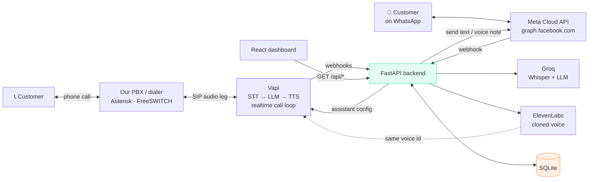
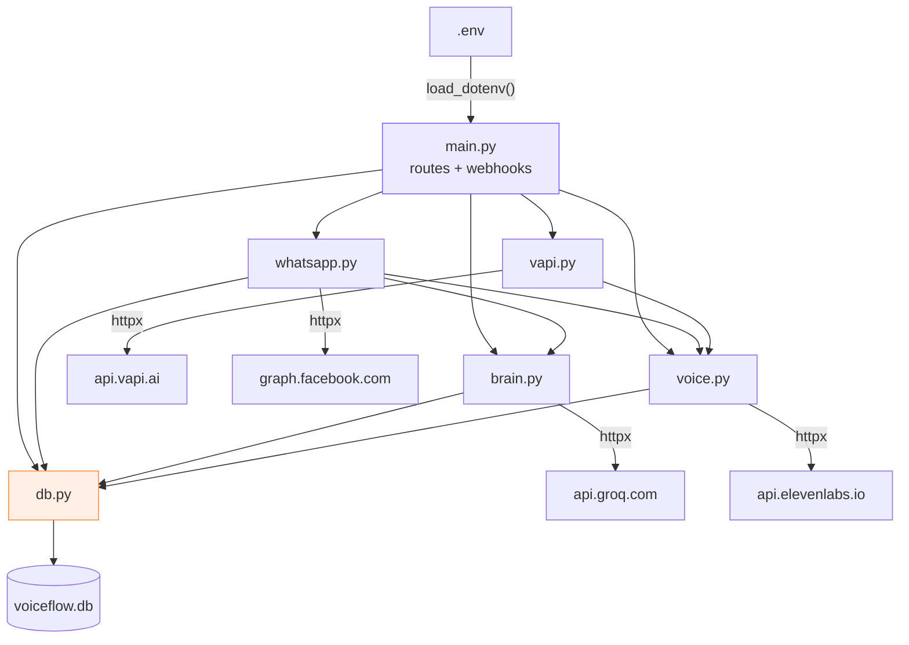
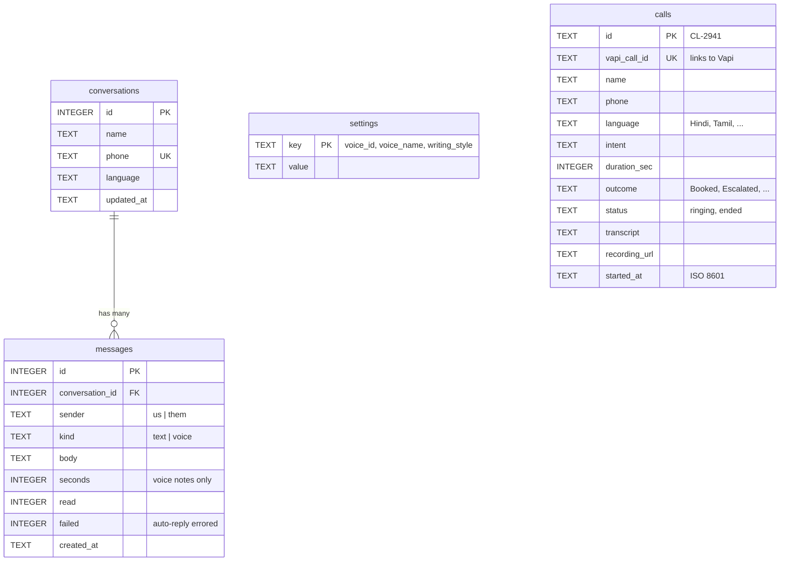
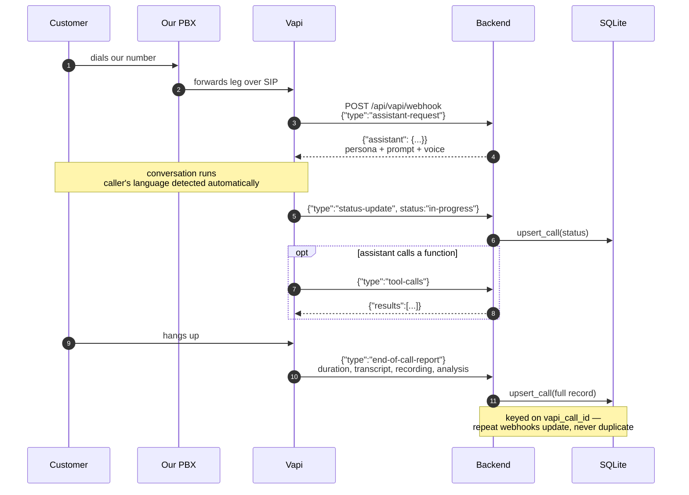
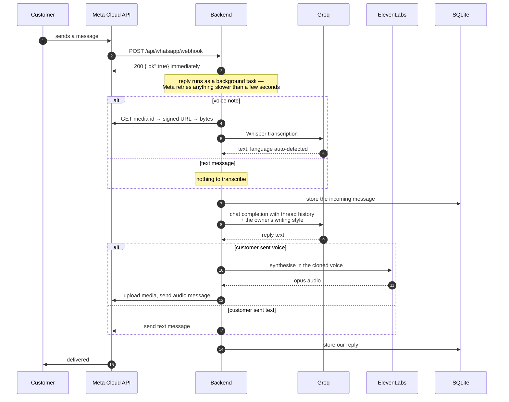
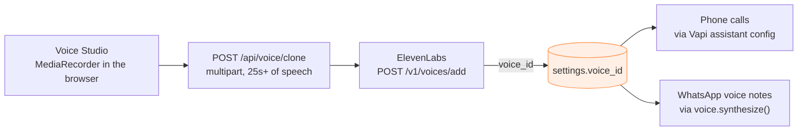
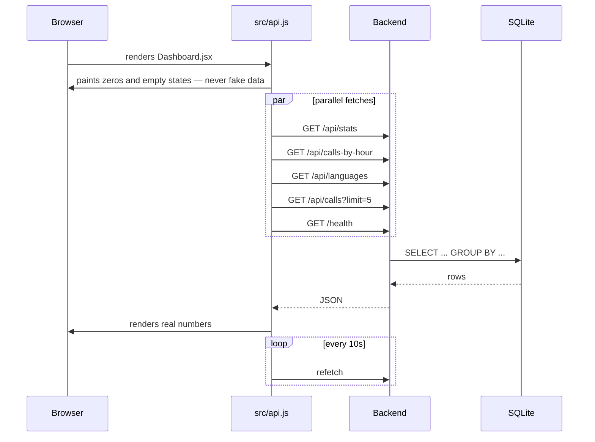

# Backend Architecture

Developer documentation for `voiceflow-ai/backend`. Explains what every file
and folder does, and how the pieces connect.

---

## 1. What this backend is responsible for

Four jobs:

1. **Serves the dashboard.** Read-only JSON endpoints the React app calls.
2. **Runs the call pipeline.** Tells Vapi how to behave on each incoming call
   and records what happened when it ends.
3. **Runs WhatsApp automation.** Receives messages, transcribes voice notes,
   generates a reply, and sends it back — text in the owner's writing style,
   voice notes in the owner's cloned voice.
4. **Owns the voice clone.** Uploads samples to ElevenLabs and keeps the
   resulting voice id, which both the phone and WhatsApp paths use.

It does **not** own the phone line — our own dialer does — and it does not run
the realtime call audio loop; Vapi does that.

There is **no demo or seed data anywhere.** A fresh database is empty and the
dashboard shows zeros until real calls and messages arrive.

---

## 2. Folder and file map

```
backend/
├── main.py            ← FastAPI app: every route lives here
├── db.py              ← SQLite schema and queries
├── vapi.py            ← Vapi client + the call assistant's persona/prompt
├── whatsapp.py        ← Meta Cloud API: receive, reply, send
├── brain.py           ← Groq: transcription + reply generation
├── voice.py           ← ElevenLabs: voice cloning + speech synthesis
├── telephony/
│   └── asterisk-extensions.conf   ← dialplan for our own PBX
├── requirements.txt   ← Python dependencies (5 of them)
├── .env.example       ← Template for secrets — committed
├── .env               ← Real secrets — gitignored, never commit
├── voiceflow.db       ← SQLite database — gitignored, auto-created, starts empty
├── venv/              ← Python virtual environment — gitignored, ~31 MB
└── __pycache__/       ← Python bytecode cache — gitignored, disposable
```

| Entry              | Type   | In git? | What it is                                                                                                   |
| ------------------ | ------ | ------- | ------------------------------------------------------------------------------------------------------------ |
| `main.py`          | file   | yes     | The FastAPI application. Every route, CORS, and the two webhook handlers.                                     |
| `db.py`            | file   | yes     | All database code. Schema, dashboard read queries, and the write functions the webhooks call.                 |
| `vapi.py`          | file   | yes     | Vapi-specific: the call assistant definition and three REST calls.                                            |
| `whatsapp.py`      | file   | yes     | Meta Cloud API: webhook verification, parsing, media up/download, and the full reply pipeline.                |
| `brain.py`         | file   | yes     | Groq: Whisper transcription, reply generation, and language detection.                                        |
| `voice.py`         | file   | yes     | ElevenLabs: instant voice cloning, synthesis, and where the voice id is stored.                               |
| `telephony/`       | folder | yes     | Config for infrastructure that runs *outside* this app — the Asterisk dialplan. No Python here.               |
| `requirements.txt` | file   | yes     | `fastapi`, `uvicorn`, `httpx`, `python-dotenv`, `python-multipart`. Pinned.                                   |
| `.env.example`     | file   | yes     | Documents every environment variable and where to get it. Copy this to `.env`.                                |
| `.env`             | file   | **no**  | Your actual API keys. Gitignored. Read once at startup by `load_dotenv()`.                                    |
| `voiceflow.db`     | file   | **no**  | The SQLite database. Created empty on first run. Delete it to reset everything.                               |
| `venv/`            | folder | **no**  | Isolated Python install. Created by `python -m venv venv`. Never edit anything inside it.                     |
| `__pycache__/`     | folder | **no**  | Compiled `.pyc` files Python writes automatically. Safe to delete at any time.                                |

**Six files contain code you will ever edit.** Everything else is config,
generated, or dependencies.

### Why the split

Each external service gets exactly one file, so a provider swap is one file's
worth of work:

| File          | Talks to             | Swap it if…                                     |
| ------------- | -------------------- | ------------------------------------------------ |
| `vapi.py`     | api.vapi.ai          | you move calls to Bland, Retell, or self-hosted   |
| `whatsapp.py` | graph.facebook.com   | you move to Twilio or 360dialog                   |
| `brain.py`    | api.groq.com         | you move to OpenAI, Together, or a local model    |
| `voice.py`    | api.elevenlabs.io    | you move to Cartesia, PlayHT, or Sarvam           |

Nothing else imports those providers' SDKs or URLs.

---

## 3. How the whole system connects



Two things worth noticing:

- **Call audio never touches our backend.** Vapi and the PBX exchange it
  directly over SIP; we only receive *events*. That's why this app stays small
  and cheap to host.
- **One cloned voice serves both channels.** `voice.py` creates it, Vapi
  receives the id for calls, and WhatsApp voice notes are synthesised with the
  same id — so the customer hears the same person either way.

---

## 4. Module dependencies

One direction of dependency. Nothing circular.



`db.py` is the leaf — it imports nothing of ours. `voice.py` depends on it only
to read and write the stored voice id.

> ⚠️ **Ordering rule:** `load_dotenv()` runs at the very top of `main.py`,
> *before* the five local imports. Every one of those modules reads
> `os.getenv(...)` at import time, so if an import moves above `load_dotenv()`
> that module's keys silently become empty strings — the app starts fine and
> then every API call 503s. This is why `main.py` carries `# noqa: E402`
> comments: the unusual import order is deliberate, not an oversight.

---

## 5. Data model



`calls` is standalone — a phone call is not linked to a WhatsApp thread. If you
ever need one customer view across both, join on `phone`.

`settings` is a two-column key/value table rather than columns on a config
table, because the things in it (the cloned voice id, the writing style) are
created at runtime, not at deploy time. Three keys live there today:
`voice_id`, `voice_name`, `writing_style`.

`messages.failed` matters more than it looks. When an auto-reply can't be sent
— a missing key, a provider outage — the error is written to the thread so the
owner can see the gap, but flagged so it does **not** count as a reply in the
WhatsApp response-rate metric.

Timestamps are stored as **ISO 8601 UTC strings**, not SQLite datetimes. The
`_ago()` and `_clock()` helpers in `db.py` convert them to `"11 min ago"` and
`"6:41 PM"` for display, so the frontend never does date maths.

---

## 6. What happens during an inbound call



Every webhook is authenticated by the `X-Vapi-Secret` header, compared against
`VAPI_WEBHOOK_SECRET`. A mismatch returns `401` before the body is parsed.

**Response deadline:** Vapi expects `assistant-request` to be answered within
7.5 seconds. That handler does no I/O — it just returns a dict — so it is
effectively instant. Keep it that way.

---

## 6b. What happens on a WhatsApp message



**A voice note gets a voice note back; text gets text back.** That mirror is
the point — the customer never has to change how they prefer to communicate.

---

## 6c. How the voice clone is created



Cloning happens once. After that both channels read the same id, so there is
never a mismatch between how the agent sounds on the phone and on WhatsApp.

---

## 7. What happens when the dashboard loads



Three deliberate behaviours:

- **`useApi` polls.** A call that lands while the dashboard is open shows up
  within ten seconds; WhatsApp threads poll every five. No refresh needed.
- **Empty ≠ broken.** With no data the page shows *"No calls yet"*, not a
  spinner and not invented numbers.
- **`/health` drives a setup panel.** Any integration missing its key is listed
  by name on the dashboard, so a blank screen is never a mystery.

---


## 8. File-by-file reference

### `main.py` — routes

| Symbol | What it does |
| ------ | ------------ |
| `load_dotenv()` | Loads `.env`. **Must stay above the five local imports.** |
| `app` | The FastAPI instance. CORS restricted to `CORS_ORIGINS`. |
| `startup()` | Runs `db.init()` — creates tables if missing. Seeds nothing. |
| `health()` | Which integrations have their keys. Drives the dashboard setup panel. |
| `stats()` … `conversations()` | Thin wrappers over `db.get_*`. No logic here on purpose. |
| `whatsapp_verify()` | Meta's GET handshake. Returns the raw challenge as text/plain. |
| `whatsapp_receive()` | Acks in milliseconds, queues each message as a background task. |
| `whatsapp_send()` | Manual send — the owner taking over a thread from the dashboard. |
| `voice_profile()` | Cloned-voice status plus the saved writing style. |
| `voice_clone()` | Multipart upload of speech samples. `Form` + `File`, not `Body`. |
| `voice_preview()` | Synthesises arbitrary text, returns audio bytes. |
| `voice_style()` | Saves the writing style WhatsApp replies imitate. |
| `outbound()` / `sip_number()` | Place a call; register our SIP endpoint. |
| `webhook()` | All Vapi events. Checks `X-Vapi-Secret`, then dispatches. |
| `_save_report()` | Flattens an `end-of-call-report` into one row. |
| `_run_tools()` | Assistant-callable functions. `book_appointment` so far. |

### `db.py` — storage

| Symbol | What it does |
| ------ | ------------ |
| `SCHEMA` | Four `CREATE TABLE`s. Idempotent — safe on every startup. |
| `connect()` | Context manager: one connection per request, commit, always close. |
| `init()` | Applies the schema. Nothing else — there is no seed path. |
| `get_setting` / `set_setting` | Key/value store for runtime config. |
| `get_stats()` | The four tiles, all SQL aggregates. Failed replies excluded. |
| `get_calls_by_hour()` | `GROUP BY strftime('%H', started_at)` for the chart. |
| `get_languages()` | Language share, stable colour per language. |
| `get_calls(limit)` | Call log, newest first, durations pre-formatted. |
| `get_conversations()` | Threads with messages and unread counts nested. |
| `get_history(phone)` | Recent turns as OpenAI-format messages, for the LLM. |
| `upsert_call()` | Insert-or-update on `vapi_call_id` — webhooks are retry-safe. |
| `add_message()` | Appends a message, creating the thread if the number is new. |
| `_ago` `_clock` `_preview` | Display formatting, so the frontend does no date maths. |

### `whatsapp.py` — Meta Cloud API

| Symbol | What it does |
| ------ | ------------ |
| `verify()` | Validates Meta's handshake against `WHATSAPP_VERIFY_TOKEN`. |
| `parse()` | Flattens Meta's nested envelope. Delivery receipts fall out here. |
| `handle()` | The whole reply pipeline for one message. Never raises. |
| `send_text()` / `send_voice()` | Outbound. `send_voice` uploads media first, then sends. |
| `download_media()` | Two hops: media id → signed URL → bytes. Both need the token. |
| `_estimate_seconds()` | Voice-note length shown on the dashboard bubble. |

### `brain.py` — Groq

| Symbol | What it does |
| ------ | ------------ |
| `system_prompt()` | Language mirroring, the owner's writing style, and the no-inventing rules. |
| `transcribe()` | Whisper. Language is auto-detected — nothing to configure. |
| `reply()` | Chat completion with thread history as context. |
| `detect_language()` | Unicode-block heuristic used to label a conversation. |
| `DEFAULT_STYLE` | Used until the owner saves their own in Voice Studio. |

### `voice.py` — ElevenLabs

| Symbol | What it does |
| ------ | ------------ |
| `clone()` | Instant voice clone from uploaded samples. Stores the id. |
| `synthesize()` | Speaks text in the cloned voice. Used for WhatsApp voice notes. |
| `voice_id()` | The active voice: the cloned one, else `VOICE_ID` from `.env`. |
| `profile()` | Status for the Voice Studio page. |
| `OUTPUT_FORMAT` / `OUTPUT_MIME` | `opus_48000_64` + `audio/ogg`. **Change both together** — see below. |

> If Meta ever rejects the audio, switch `OUTPUT_FORMAT` to `mp3_44100_128` and
> `OUTPUT_MIME` to `audio/mpeg`. That always works but renders as a plain audio
> attachment instead of a voice note with a waveform.

---

## 9. Where to change what

| You want to… | Edit |
| ------------ | ---- |
| Change how the agent talks on calls | `SYSTEM_PROMPT` in `vapi.py` |
| Change how it writes on WhatsApp | Voice Studio → Writing style (saved to the DB) |
| Change the call greeting | `firstMessage` in `vapi.assistant()` |
| Use a different LLM | `GROQ_MODEL` in `.env` — no code change |
| Swap a whole provider | The one file that owns it — see the table in section 2 |
| Add a dashboard metric | New query in `db.py`, one-line route in `main.py` |
| Add a column | Add to `SCHEMA` **and** delete `voiceflow.db` so it recreates |
| Let the assistant do something new on calls | Add a tool in `_run_tools()`, declare it in `vapi.assistant()` |
| Start over | Delete `voiceflow.db` |

---

## 10. Known limits

Deliberate for now, with the upgrade path:

- **SQLite, single file.** Fine for one business. Move to PostgreSQL when you
  need concurrent writers — only `db.py` changes.
- **No auth on `/api/*`.** The dashboard endpoints are open. Add a token check
  before exposing this publicly. The two webhooks *are* authenticated.
- **Background tasks are in-process.** If the server restarts mid-reply, that
  reply is lost. A queue (Celery, RQ) fixes it when volume justifies one.
- **`detect_language` is a heuristic.** Unicode-block matching with a small
  Marathi word list. It labels the dashboard only — it never affects the reply,
  which mirrors the customer's language via the prompt.
- **WhatsApp voice replies only fire for voice input.** A text message always
  gets text back, by design.
- **No retry on provider failure.** A failed auto-reply is written to the thread
  and flagged; it is not retried.
