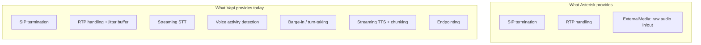
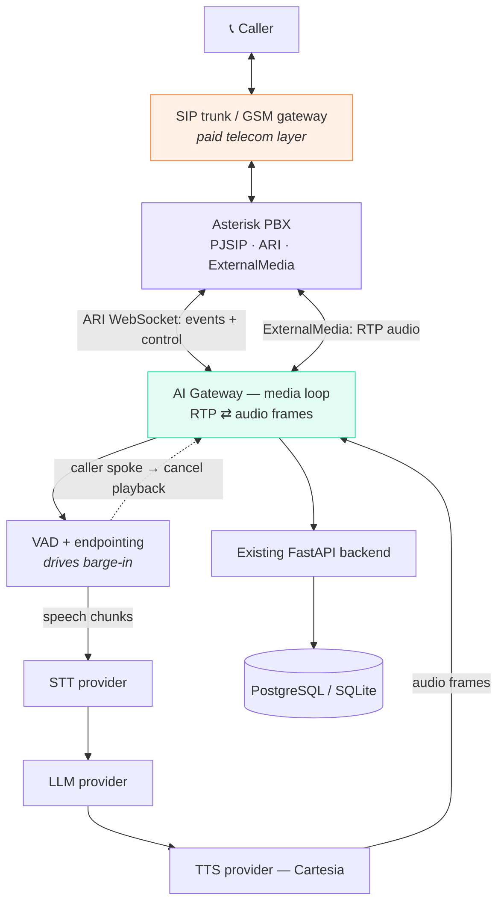

# Asterisk telephony — analysis before implementation

Kunal's spec asks for the design *before* the code. This is that document: what
we already have, what Asterisk actually changes, what each phase costs, and the
one decision that has to be made before any of it starts.

---

## 1. What already exists

The backend is already built as a telephony adapter. That was the right call and
it does not need rewriting:

| Seam | Where | What Asterisk changes |
| ---- | ----- | --------------------- |
| Place a call | `POST /api/calls/outbound` | Body stays `{number}`. Only the implementation behind it changes. |
| Call finished | `_save_report()` in `main.py` | Fed by an ARI event instead of a Vapi webhook. |
| Agent persona | `SYSTEM_PROMPT` in `vapi.py` | Moves to the gateway, unchanged in content. |
| Cloned voice | `voice.py` → `settings.voice_id` | Unchanged. Same Cartesia voice. |
| Call log | `calls` table | Needs three new columns — see §5. |
| Dashboard | `GET /api/calls`, `/api/stats` | Unchanged. |

So the spec's instruction — *"Build Asterisk as the telephony adapter for the
existing Voice Flow AI system, do not create a second AI platform"* — is already
satisfied structurally. What's missing is the adapter itself.

---

## 2. What Vapi is actually doing today

This matters, because "replace Vapi with Asterisk" is not a like-for-like swap.



Asterisk replaces the **bottom two boxes**. Everything from streaming STT to
barge-in is code we would have to write ourselves in the AI gateway.

That is the real cost of this project, and it's Phases 6–11 in Kunal's plan.

---

## 3. Target architecture



The dotted line is barge-in, and it is the hardest arrow on this diagram.

---

## 4. Provider abstraction

The spec's interfaces are right. In Python they become:

```python
class SpeechToText(Protocol):
    async def stream(self, audio: AsyncIterator[bytes]) -> AsyncIterator[str]: ...

class LLM(Protocol):
    async def respond(self, messages: list[dict]) -> AsyncIterator[str]: ...

class TextToSpeech(Protocol):
    async def speak(self, text: AsyncIterator[str]) -> AsyncIterator[bytes]: ...

class Telephony(Protocol):
    async def place_call(self, number: str, agent_id: str) -> str: ...
    async def hang_up(self, call_id: str) -> None: ...
```

`AsteriskProvider`, `VapiProvider`, `ExotelProvider` all implement `Telephony`.
Our current `vapi.py` becomes `providers/vapi.py` with no logic change — that
part is genuinely a one-hour refactor.

**Important:** our current providers are not all stream-ready.

| Piece | Today | Stream-capable? |
| ----- | ----- | ---------------- |
| STT | Groq Whisper (batch HTTP) | ❌ needs Deepgram / AssemblyAI / local whisper-streaming |
| LLM | NVIDIA nemotron (~1.8s) | ⚠️ streams, but too slow for realtime turns — Groq is better here |
| TTS | Cartesia | ✅ Cartesia has a WebSocket streaming API |

So Phase 7 is not "plug in what we have" — the STT provider has to change.

---

## 5. Database changes

Additive only. Nothing existing breaks:

```sql
ALTER TABLE calls ADD COLUMN agent_id           TEXT;
ALTER TABLE calls ADD COLUMN asterisk_channel_id TEXT;
ALTER TABLE calls ADD COLUMN answered_at        TEXT;

CREATE TABLE call_messages (
    id         INTEGER PRIMARY KEY AUTOINCREMENT,
    call_id    TEXT NOT NULL REFERENCES calls(id),
    speaker    TEXT NOT NULL CHECK (speaker IN ('caller','assistant','system')),
    message    TEXT NOT NULL,
    latency_ms INTEGER,
    created_at TEXT NOT NULL
);
```

`call_messages` is what makes per-turn latency visible — the metric that tells
you whether the realtime loop is actually working.

---

## 6. Phases, with honest cost

Kunal's ordering is correct. The estimates are mine.

| Phase | Work | Effort | Risk |
| ----- | ---- | ------ | ---- |
| 1–3 | Install Asterisk, PJSIP extensions 1001/1002, softphone registers and calls | half day | low |
| 4–5 | Dialplan answers, `Stasis()`, ARI WebSocket connects, events logged | half day | low |
| 6 | **ExternalMedia: RTP audio in and out of the gateway** | 1–2 days | **high** |
| 7 | Streaming STT wired in (provider change required) | 1 day | medium |
| 8–9 | LLM + streaming TTS into the media loop | 1 day | medium |
| 10 | Full duplex conversation, endpointing, turn-taking | 2–3 days | **high** |
| 11 | **Barge-in** — VAD cancels in-flight playback mid-sentence | 2–3 days | **high** |
| 12–13 | Call logging, optional recording | half day | low |
| 14 | SIP trunk or GSM gateway | depends on vendor | medium |
| 15 | Hardening: fail2ban, TLS, toll-fraud limits | 1 day | medium |

**Phases 1–5 are a day and give a real, demoable result** — a call that connects
to our code. Phases 6–11 are the actual project, roughly 7–10 focused days.

---

## 7. Local setup — Docker, not WSL Ubuntu

This machine has WSL2 but only the `docker-desktop` distro; there is no Ubuntu
installed. Two options:

**Option A — Docker (recommended, Docker Desktop is already running)**

```bash
docker run -d --name asterisk --network host -v "${PWD}/asterisk:/etc/asterisk" andrius/asterisk:20
```

Config lives in the repo and is mounted in, so it's version-controlled.
`--network host` matters: SIP and RTP use many UDP ports and NAT-ing them
through Docker's bridge is the single most common cause of one-way audio.

**Option B — Ubuntu in WSL2**

```bash
wsl --install -d Ubuntu-24.04
```

~1.5 GB download, then a username/password prompt you have to answer. Closer to
production, slower to start.

Either way, **`--network host` does not work the same on Docker Desktop for
Windows.** For local softphone testing on Windows, Option B is actually the
safer path despite being slower to set up. Worth knowing before starting.

---

## 8. Costs — what is and isn't free

| Free | Paid |
| ---- | ---- |
| Asterisk, PJSIP, ARI | Phone number / DID |
| Our AI gateway | SIP trunk minutes |
| SIP softphone (Linphone, MicroSIP) | SIM + GSM/LTE gateway hardware (₹8k–₹25k) |
| PostgreSQL / SQLite | STT, LLM, TTS API usage |
| | Server to host it |

**Asterisk is not a free phone number.** It is a free PBX. Reaching a real
mobile network always costs money — either a SIP trunk subscription or gateway
hardware plus a SIM.

**Toll fraud is the real danger.** An Asterisk box reachable from the internet
with weak SIP credentials gets scanned within hours, and attackers route
international calls through it. Bills of ₹1–5 lakh in a weekend are common and
the telco will hold you liable. Non-negotiable: no `allowguest=yes`, strong
per-endpoint passwords, fail2ban on port 5060, firewall allowing only the
trunk's IPs, and a hard cap on concurrent and international calls.

**GSM gateway legality:** routing commercial traffic over a consumer SIM is
against the terms of most Indian carriers and can get the SIM disconnected.
Verify with the carrier before relying on it.

---

## 9. The decision

Phases 6–11 rebuild what Vapi does today. That's 7–10 days of the hardest
category of work — realtime audio — and it is the part most likely to be
half-working at a demo.

Two sane paths:

**Path 1 — Asterisk for SIP, Vapi for the loop.** Asterisk owns the number,
routing, dialplan and call records; the audio leg goes to Vapi over SIP.
Already built and working. Gets Phases 1–5 done and stops there. Own
infrastructure, no realtime-audio risk.

**Path 2 — Full self-hosted loop.** Build Phases 6–11. Nothing leaves our
servers, no per-minute vendor billing, matches the pitch exactly. Costs the
7–10 days and needs an STT provider change.

Path 1 is what I'd ship for a deadline. Path 2 is the right long-term answer if
the pitch depends on being fully self-hosted.
