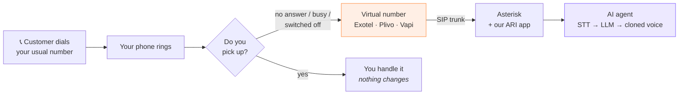

# Connecting a real phone to the AI

The question: *"my phone rings — I want this system to answer and talk to the
caller."*

The short answer: your personal mobile number cannot point at a server. No
Indian carrier allows a consumer SIM to hand calls to a webhook. What you do
instead is **forward** calls from your number to a number that *can* reach a
server.

That forwarding model is not a workaround — it is the product. Your phone rings
first. If you pick up, nothing changes. If you don't, the AI does.

---

## How it actually works

The forwarding is set on your handset with a GSM code, and it is **conditional**
— it only fires when you don't answer.

| Code | When it forwards |
| ---- | ---------------- |
| `**61*<number>*11*20#` | You don't answer within 20 seconds |
| `**67*<number>#` | Your line is busy |
| `**62*<number>#` | Phone is off or out of coverage |
| `**21*<number>#` | **Every** call, immediately — for a demo, not daily use |
| `##002#` | Cancel all forwarding |

Dial the code from your phone's dialler like a normal number. Works on Jio,
Airtel, Vi and BSNL.

> Use `**61*` for real use. `**21*` sends every call to the AI, which is what
> you want on a demo day and not what you want on a Tuesday.

---

## Three ways to get the virtual number

### Path A — Exotel or Plivo (the real India answer)

Both give you an Indian number that can hand calls to your own SIP server.
Exotel's virtual SIP trunking sends a SIP INVITE straight to your Asterisk,
which is exactly what `asterisk/pjsip.conf` is already set up for.

**The gate is KYC, and it is a real gate.** Plivo requires an India-region
account plus a Business Registration Certificate — a Certificate of
Incorporation from MCA, *or* an Udyam certificate from MSME — plus a business
PAN or GST certificate. Exotel requires the same class of documents. Approval is
about a business day once you have them.

If you don't have a registered company, **Udyam registration is free, online,
and issued immediately** — it needs Aadhaar and PAN and is designed for exactly
this kind of small operation. That is usually the fastest route to a document
these providers will accept.

- Cost: roughly ₹500–1,500/month for the number, plus per-minute charges
- Time: same day if you already have the documents

### Path B — GSM/LTE gateway with a spare SIM

A box with a SIM slot that registers to Asterisk as a SIP endpoint. Calls to
*that SIM's* number get answered by the AI. Your main number can forward to it.

- Cost: ₹8,000–25,000 for the gateway, plus a SIM
- Time: however long shipping takes
- **Caveat:** routing commercial traffic over a consumer SIM violates the terms
  of most Indian carriers and can get the SIM disconnected. Check before you
  rely on it.

### Path C — Vapi trial number (fastest demo, not an Indian number)

A Vapi account includes a free number. The AI answers it immediately — no KYC,
no hardware, works today. But it is a **US number**, so Indian callers pay
international rates, and it is not something a real customer would dial.

Good for: proving the system works, recording a demo video.
Not good for: an actual business.

Vapi does not sell Indian DIDs. For an Indian number you still need Exotel,
Plivo or Twilio underneath.

---

## What you can demo right now, with nothing

Already built and working:

- **Web call** — `/app/web-call`. Click, talk, the agent answers in the cloned
  voice. No number, no KYC, no cost. For a hackathon this demos the *entire*
  pipeline convincingly.
- **WhatsApp** — needs only a Meta test number, which is free and instant.

If the judges want to see a phone ring, Path C gets you there in an hour.

---

## Once you have the number: wiring it up

Everything below assumes Asterisk from [ASTERISK.md](ASTERISK.md) is running.

**1. Add the trunk.** Uncomment the trunk block at the bottom of
`asterisk/pjsip.conf` and fill in the credentials your provider gives you.
Inbound calls land in the `voiceflow-inbound` context, which already routes into
our ARI app.

**2. Point the provider at your server.** Exotel and Plivo both need a public IP
or hostname for the SIP INVITE — a laptop behind a home router will not work.
A ₹500/month VPS is enough.

**3. Lock it down before it goes public.** An Asterisk box with a public IP and
a weak SIP password gets scanned within hours and used to route international
calls on your account. Bills of ₹1–5 lakh over a weekend are routine and the
telco holds *you* liable. The checklist is at the end of
[ASTERISK.md](ASTERISK.md); none of it is optional.

**4. Set the forwarding code** on your phone and call yourself from another
number.

---

## Honest summary

| What you want | What it costs | How long |
| ------------- | ------------- | -------- |
| Demo the full pipeline today | ₹0 | Already done — `/app/web-call` |
| Hear a phone ring and the AI answer | Vapi account | ~1 hour |
| A real Indian number customers can dial | Udyam/GST + Exotel or Plivo + VPS | 1–3 days |
| Your existing number, untouched, AI catches missed calls | Above + `**61*` forwarding | Same day after the number works |

There is no free path to an Indian phone number. Asterisk is free; the phone
network is not.
