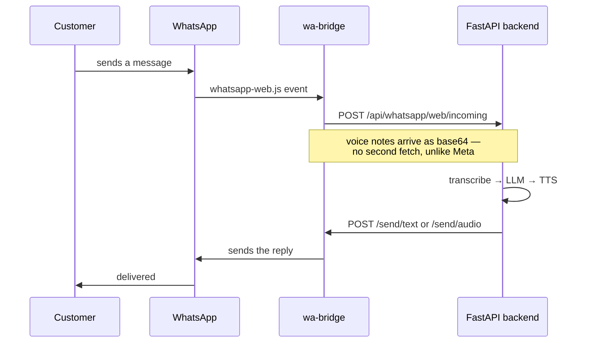

# wa-bridge

Connects **one** WhatsApp number to the VoiceFlow backend by driving WhatsApp
Web. No Meta Business account, no KYC, no approval wait — scan a QR code and it
works in about two minutes.

Written from scratch. [OpenWA](https://github.com/rmyndharis/OpenWA) was the
reference for how this kind of gateway is structured; none of its code is here.
It solves a much bigger problem — multi-session, plugins, RBAC, a dashboard —
and all of that already lives in our backend. This is only the part we needed.

---

## ⚠ Read this before connecting a number

This drives WhatsApp Web through a headless browser. That is **against
WhatsApp's Terms of Service**, and numbers used this way do get banned —
sometimes within days, sometimes never. There is no appeal process worth
relying on.

- Use a **dedicated SIM** you can afford to lose. Never a personal number, never
  the number a real business already runs on.
- Warm it up: use it like a human for a few days before automating replies.
- Do not blast messages. Inbound replies are far safer than outbound campaigns.
- Keep the Meta Cloud API path (`WHATSAPP_PROVIDER=meta`) as the production
  plan. This is how you demo and validate, not how you scale.

If the number matters, get Meta Cloud API access instead — see
[../docs/WHATSAPP_SETUP.md](../docs/WHATSAPP_SETUP.md).

---

## Setup

```bash
npm install
```

Puppeteer tries to download its own Chromium (~150 MB). If that step fails or
gets interrupted — it often does — the bridge falls back to a Chrome or Edge
already installed on the machine, so it still starts. Override the choice with
`CHROME_PATH` if you need a specific one.

To repair Puppeteer's own copy instead:

```bash
npx puppeteer browsers install chrome
```

Set the same token the backend has in `backend/.env` as `WA_BRIDGE_TOKEN`:

```bash
BRIDGE_TOKEN=<same-value> npm start
```

A QR code prints in the terminal. It also appears in the dashboard at
**/app/whatsapp**, which is usually easier — scan with
**WhatsApp → Settings → Linked devices → Link a device**.

The session is saved to `.session/`, so restarts reconnect without a new QR.
Delete that folder to force a fresh link.

Then in `backend/.env`:

```
WHATSAPP_PROVIDER=web
```

---

## How it fits together



The bridge holds no logic. It does not know about agents, transcription or the
database — it only moves messages. Every decision stays in the Python backend,
so switching back to `WHATSAPP_PROVIDER=meta` changes nothing else.

## API

| Route | Purpose |
| ----- | ------- |
| `GET /status` | `starting` · `qr` · `connected` · `disconnected` · `auth_failure` |
| `GET /qr` | The QR as a PNG. The only route with no token check, so the dashboard can show it before anything is linked. |
| `POST /send/text` | `{ to, text }` |
| `POST /send/audio` | `{ to, audio_base64, mime }` — sent as a voice note |
| `POST /logout` | Unlink the number |

Every route except `/qr` requires `X-Bridge-Token`. Without it, anything else
running on the machine could send messages from your number.

## Environment

| Variable | Default | Meaning |
| -------- | ------- | ------- |
| `BRIDGE_PORT` | `8100` | Port for this service |
| `BACKEND_URL` | `http://127.0.0.1:8000` | Where incoming messages are posted |
| `BRIDGE_TOKEN` | *(empty)* | Shared secret. Empty disables the check — only safe on a laptop. |
| `CHROME_PATH` | *(auto)* | Browser to drive. Auto-detects Chrome, then Edge, then Puppeteer's own. |

## What it deliberately ignores

Group chats, status broadcasts, and our own messages. This agent answers
one-to-one customer conversations; a bot replying inside a group is how numbers
get reported.
